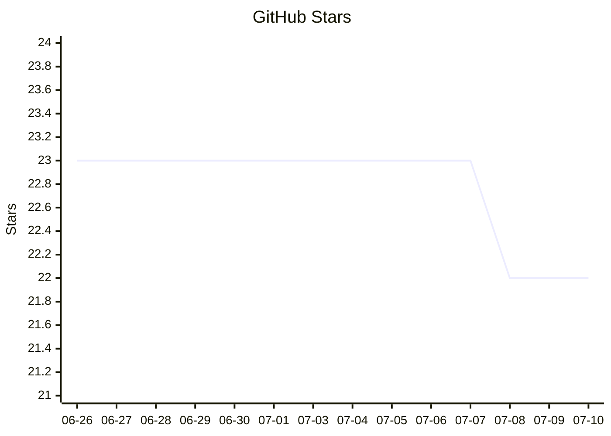

# MoonClaw

> 🐇 MoonBit-native agent runtime + 📡 gateway + 🧠 memory + 🗂️ job system + 🤖 ACP remote-agent control

`MoonBit` `Agent Runtime` `Gateway` `Jobs` `ACP` `Feishu` `Weixin` `Memory` `Artifacts` `Operator UI`

MoonClaw is an agent and automation system built on top of [moonbitlang/maria](https://github.com/moonbitlang/maria), and shaped around a full job runtime instead of a thin chat wrapper.

For executable MoonBooks, MoonClaw is the runtime owner for agent, task, session, and execution concepts. See [Executable Book Runtime Boundary](docs/executable_book_runtime_boundary.md).

Start with [docs/README.md](docs/README.md) for the product boundary,
implementation map, testing guidance, operational notes, and future plan.
The stricter pack/runtime ownership rules are documented in
[Responsibility and Testability](docs/RESPONSIBILITY_AND_TESTABILITY.md).

It is designed for:

- 💬 chat-driven planning
- ⚙️ long-running background jobs
- 🧪 analysis workflows
- 📁 dedicated run workspaces with git checkpoints
- 🧠 structured long-term memory
- 🌐 gateway + operator UI
- 🤖 local jobs working alongside ACP remote agents

## ✨ What MoonClaw Feels Like

```text
chat / CLI / Feishu / web UI
  -> draft a proposal
  -> compile to workflow
  -> execute as a job
  -> persist artifacts, memory, and workspace state
  -> inspect local + remote activity from one operator surface
```

MoonClaw is strongest when you want one system to handle:

- 🛠️ local execution
- 🔄 async orchestration
- 🧾 durable outputs
- 🧭 operator control
- 🤝 local-agent + remote-agent handoff

## News

- `2026-07-12`: added `mooncode.quality-trial.v1` to native `run_eval` receipts. MoonCode now diagnoses incomplete inventory, domain assumptions, native tool uncertainty, missing positive/negative cases, exit-code proof, packaging, review, and unsupported claims; it revises general inputs within a bounded budget and turns repeated identical failure into a Bookkeeper execution gap.
- `2026-07-11`: added workspace-aware evidence-dossier validation. `moonclaw
  evidence validate <book-root> <dossier.json> <receipt.json>` now requires
  every declared `artifact_ref` to exist, remain book-relative, and resolve
  inside the canonical MoonBook root. Remote locators remain provenance, but
  cannot substitute for a locally tracked retrieval artifact. See
  [Evidence Quality](docs/evidence_quality.md).
- `2026-06-15`: added the first native MoonCode daemon endpoint slice for
  MoonDesk: `/v1/code/capabilities`,
  `/v1/code/sessions/<id>/commands`,
  `/v1/code/sessions/<id>/stream`, and
  `/v1/code/sessions/<id>/eval-report?book_root=<path>`, plus package proof ingestion at
  `/v1/code/sessions/<id>/package-result`. Commands bind a MoonDesk MoonCode
  session to a durable book-local command queue by default; native
  `runtime-turn`/`runtime-loop` execute the queued command without spawning a
  generic task. Native command handling now distinguishes
  `prompt`, `steer`, and `cancel`; runtime-turn now consults the same
  MoonCode runtime control it exposes through `runtime-control`, returns
  the control state/decision in the turn payload, emits `steer_applied` /
  `steer_deferred` / `steer_dropped` settlement events for steering commands,
  injects deferred steering into the next eligible turn, and records
  `cancel_dropped` for idle cancel commands instead of running fallback tools.
  Package-result packets record command-scoped
  `package_built` and `package_verified` runtime evidence for MoonBook-owned
  executable artifacts. Native package manifests also promote generated source
  files into
  `portable/app-tool/mooncode/<session-id>/sources/<command-id>/...`, and the
  native MoonCode stream now replays book-local MoonCode events without
  mirroring generic task event streams.
  Eval reports now run a first native MoonCode eval harness slice over
  `read`, `write`, `edit`, `shell`, `moon_check`, `finish`, and file-edit diff
  evidence before returning `ok`, `required_harnesses`, and nested native
  harness results.
  MoonClaw persists native MoonCode sidecars in the MoonClaw product home
  derived from the selected book root:
  `.moonsuite/products/moonclaw/mooncode/sessions/<session-id>/`, including
  the replaceable `session.json` checkpoint and authoritative `journal.jsonl`.
  Commands, receipts, events, package results, and book results share one
  contiguous exact journal sequence. Current writers use
  `moonsuite-conversation-journal.v2`, MoonCode's exact-sequence extension of
  MoonLib's v1 journal contract. Its canonical decimal-string sequences remain
  replay-compatible with MoonLib v1 numeric envelopes.
  Production append scans under an exclusive stable session lock, repairs only
  a torn suffix, writes one canonical JSONL record with an exact successor, and
  requests ordinary file-data synchronization plus supported parent-directory
  synchronization. Newly written `session.json` checkpoints carry
  `mooncode-session-snapshot.v2`. Full diagnostic projections carry
  `mooncode-session-record.v2` and derive a sibling `mooncode_conversation`
  projection under `moonsuite-conversation.v3`; checkpoints do not embed that
  conversation. Only the outer `format=listing` envelope carries
  `mooncode-session-listing.v2`; individual rows do not. A loaded legacy
  checkpoint may remain legacy until rewritten. Stream projections use
  `mooncode-stream.v2`. Suite-hosted
  `books/<book-id>` roots resolve to
  the owning suite's MoonClaw product home; standalone book roots use their own
  local `.moonsuite/products/moonclaw` product home. The daemon can list/show
  those cold sidecars with `GET /v1/code/sessions?book_root=<path>` and
  `GET /v1/code/sessions/<id>?book_root=<path>`, and can lease the next
  unresolved durable command with
  `GET`/`POST /v1/code/sessions/<id>/runtime-claim?book_root=<path>` by
  appending native `runtime-claimed` records to the same journal.
  Native MoonCode clients execute work through `runtime-turn`/`runtime-loop`;
  no `/v1/code` endpoint forwards commands into the generic `/v1/task`
  runtime. Durable `cancel` commands are queue controls settled by the native
  runtime.
  `GET`/`POST /v1/code/sessions/<id>/runtime-events?book_root=<path>` now
  lets a MoonClaw runtime append normalized
  transcript/tool/diff/test/artifact/review/runtime evidence directly into
  `journal.jsonl`, closing the durable stream-ingress half of the native
  runtime contract. `POST
  /v1/code/sessions/<id>/tool-exec?book_root=<path>` now executes the
  native MoonCode `read`, `edit`, `write`, `shell`, `moon_check`, and `finish`
  tool contract inside the selected MoonBook root and appends command-scoped
  proof events. `POST
  /v1/code/sessions/<id>/runtime-turn?book_root=<path>` now provides the
  first book-local native runtime turn: it claims the next durable command if
  needed, executes explicit `runtime_tool_calls` or deterministic built-in
  fallbacks such as `run_tests -> moon_check + finish`, appends runtime/tool
  events, returns the runtime-control state/decision that authorized or dropped
  the claimed command, and either closes it with `runtime-completed` or
  `runtime-failed`, or returns a durable nonterminal planner pause without a
  receipt when the local step quantum ends. Idle `steer` controls are persisted
  as `steer_deferred`
  context for the next eligible turn, and idle `cancel` controls are finalized
  as `cancel_dropped` evidence without invoking tools, matching runtime control
  projection instead of treating controls as ordinary prompts.
  `POST
  /v1/code/sessions/<id>/runtime-loop?book_root=<path>` now layers a
  bounded queue supervisor over that turn primitive: it repeatedly runs native
  turns until the durable command queue is idle, a turn fails, a cancel command
  lands, or `max_turns` is reached, returning per-turn evidence plus the final
  claim state.
  `/commands` now defaults to native queue mode, which appends the durable
  command without spawning or messaging the generic MoonClaw task runtime so a
  client can call `runtime-turn` without duplicate execution.
  A strict additive `GET/PUT
  /v1/code/sessions/<id>/goal-runtime?book_root=<path>` boundary now persists
  criteria-only `mooncode-goal-runtime.v1` genesis and projects replayed status.
  It rejects aggregate token/turn/step/time/operation/LOC fields and treats retry
  timestamps as non-semantic. Goal authority and supervisor reconciliation now
  fold canonical JSONL one record at a time, use an ephemeral disk identity ledger
  for exact far-apart deduplication/conflict detection, and spool source facts on
  disk instead of retaining aggregate event/ID arrays. The legacy `/goal` HTTP
  route has been removed and `/goal-runtime` is a required capability. Persisted
  legacy histories remain strictly detectable and return `legacy_goal_incompatible`;
  they are never silently converted because their aggregate budget semantics have
  no lossless representation in the unbounded contract. The common runtime-turn
  path derives typed running, approval, operation, and planner checkpoint events
  from already-committed source facts, and restart reconciliation fills a crash gap
  idempotently from stable source IDs. For an active runtime goal,
  runtime-service repeats `max_turns` as a local execution quantum instead of
  treating it as an aggregate stop. The planner receives the active objective and
  exact criterion IDs; optional typed `finish.goal_runtime` decisions settle
  Achieved or Blocked, while ordinary finish remains nonterminal goal progress.
  Exact active-target cancellation settles Cancelled; idle, stale, timeout, failure,
  and local-quantum events do not. Runtime-turn now also includes a resumable prompt planner: ordinary
  `prompt` commands that ask for a tool, script, miniapp, generated site, or
  HTML app expand into native `write`, `shell`, and `finish` tool calls under
  MoonBook-owned `tools/` or `apps/` paths, so plain MoonCode chat can create
  and verify an executable artifact without predeclared tool calls. `steer`
  commands settle as steering context by default instead of starting a new
  artifact-generation plan. `accept` and `reject` commands settle
  deterministically by writing MoonBook-owned review receipts under
  `wiki/reviews/mooncode/<session-id>/` and emitting review-lane
  `receipt.accept` / `receipt.reject` evidence instead of asking a model to
  reinterpret the operator decision. `commit` commands now run book-local git
  status/add/commit/rev-parse, exclude the fresh internal `.moonsuite` and
  `.tmp` lanes from staging, and emit review-lane
  `runtime.commit_created` proof with the resulting SHA only after the commit
  succeeds. `run_eval` commands now run MoonClaw's native MoonCode
  tool/file-edit harnesses from runtime-turn, write
  `wiki/reviews/mooncode/<session-id>/eval-report.json`, and emit
  `eval_report.manifest` proof with `tool_harness` and `file_edit` results.
  Eval success is no longer accepted merely because commands exist. Qualification
  additionally requires nearest-module inventory, reviewed assumptions, native
  checks and tests, positive and negative cases, exact exit codes, package
  proof, a review receipt, and claim discipline. Failed attempts remain in the
  trial lineage, and reusable instructions never embed the scenario answer.
  `run_tests` commands now convert the native `moon_check` execution into a
  first-class command-scoped `test_result` proof event with pass/fail status,
  exit status, capped output, and the original command packet, so MoonDesk can
  close test gates from MoonClaw-owned evidence instead of inferring from a
  generic tool result.
  When
  a queued command carries an explicit selected model, runtime-turn can also ask
  that model for MoonCode tool-call batches over `read`, `write`, `edit`,
  `apply_patch`, `revert_patch`, `shell`, `moon_check`, and `finish`; successful
  tool results are fed back to the model until it calls `finish`, a tool fails,
  or the command is cancelled. `planner_max_steps` is a per-turn execution
  quantum, not an aggregate completion bound. Reaching it persists the complete
  planner transcript and tool results as a nonterminal checkpoint, leaves the
  command claimed, and returns `completed=false`, `paused=true`, and
  `control=continue` without a terminal receipt. A later runtime turn resumes at
  `next_step_index` and does not replay completed tools, including after daemon
  restart. Planner start/selection/failure events, `planner_steps`, native
  `reasoning_delta` progress, optional assistant deltas, and pre-execution
  `tool_call` events are recorded so MoonDesk can render a live coding-agent
  transcript from MoonClaw-owned evidence. Unsupported or empty model plans fall
  back to the deterministic planner.
  Native `apply_patch` and `revert_patch` execute bounded reviewed text
  replacements plus single-file or multi-file unified-diff patchsets inside
  the selected MoonBook root, infer target paths from diff headers when needed,
  and emit `runtime.patch_applied` / `runtime.patch_reverted` proof events for
  MoonDesk review gates. They also accept `hunk_index`/`hunk_id` or hunk
  targets such as `tools/demo/main.mbt#hunk-2`, apply only that selected hunk,
  and report `hunk_control_scope`, `selected_hunk_index`,
  `available_hunk_count`, and `file_path` metadata. Patch tool packets can
  request post-change
  verification with `verification_command`, `test_command`, `verify_after`, or
  `moon_check_target`; MoonClaw records the command, status, capped output, and
  pass/fail result under the patch proof metadata.
  Successful native turns now also write MoonBook package manifests and an
  index under `portable/app-tool/mooncode/<session-id>/`, append
  `package_built` and `package_verified` proof to the session journal,
  promote generated source files under the package root with source hashes, and
  emit artifact-lane package events for MoonDesk's package review surface. The
  remaining MoonCode runtime gap is the full persistent MoonCode agent
  service with long-running live steering/cancel UX, diff-aware edit review, and
  broader model-backed coding eval coverage.
- `2026-05-22`: hardened dedicated gateway startup for Feishu websocket operation; channel auto-restore now runs as a background gateway lifecycle task instead of blocking HTTP startup, `gateway start` uses the configured gateway auth token consistently with CLI probes, RPC responses encode `null` payload/error fields correctly, and credential-bearing gateway logs are redacted. Runtime artifacts under `.moonsuite/products/...`, disposable traces under `.tmp/products/...`, and `raw/bootstrap/` are ignored so local test state cannot leak into commits.
- `2026-04-21`: hardened provider-backed bootstrap execution for town/book integrations; provider tasks now run bounded `bootstrap_gather`, `source_materialize`, `knowledge_revise`, and `review_finalize` phases, emit parent `child_run.*` lifecycle events, compact long provider task ids before they reach journals, and refresh catalog surfaces so generated `wiki/index.md` lists durable source/entity/concept pages
- `2026-04-18`: fixed provider-run closeout so broadcast listeners stop cleanly after `PostConversation`; provider-backed wiki ingest now advances through adaptive child phases like `bootstrap_gather` and `source_materialize` instead of leaving completed child analysis runs stuck in `Running`
- `2026-04-15`: shortened persisted per-step metadata filenames to a bounded slug-plus-hash form so long delegated requests no longer crash with `File name too long`; logical `step_id` values remain unchanged in run state and UI
- `2026-04-13`: added external proposal packet import with `moonclaw proposal import <packet.json> [--confirm]`; imported packets are validated, converted into normal stored proposals, mapped onto configured job profiles, and optionally confirmed/executed through the standard workflow engine
- `2026-04-13`: generalized provider-backed execution into a reusable extension-task boundary; analysis and delegate steps can now target task providers via `execution_mode: "provider"` / `"extension"` plus `execution_target`,
- `2026-04-05`: added a concrete wiki-maintainer extension pack, a wiki-specific test guide, and automatic workspace detection for `raw/` + `wiki/` layouts so planning/execution can see `wiki/index.md`, `wiki/log.md`, and key wiki directories as part of runtime context
- `2026-04-04`: added the Rabbita `Cowork` surface with a conversation sidebar, transcript, composer, plan-mode actions, linked proposal/run cards, and a right-side context pane for preview, workspace, artifacts, and run state
- `2026-04-04`: added thread-local `/plan` mode with `/preview` and `/promote`; made final run `report.md` and `result.json` appear as clickable Rabbita cards; added a full-screen canvas toggle, aggregated starter documents into one operator-facing input card, and upgraded artifact opening from a small popup into a full-screen editor surface
- `2026-04-01`: clarified the execution layer with uniquely named analysis helpers, `delegate_run`, `patch_edit`, and `resource_providers`; hardened the analysis backbone by separating execution and tool contracts; added a first-class `web_fetch` tool and made analysis distinguish web search from web fetch instead of relying on loose booleans
- `2026-03-26`: split classic `/plan-job` from the E2E `/e2e` flow; added job-level preprocess and optional postprocess planning, in-place `/resume` from `WaitingForInput`, tighter planner skill enforcement, and assumption-based continuation for blocked analytical runs
- `2026-03-25`: added adaptive step expansion with `needs_input` / `needs_subplan`, `WaitingForInput` pause-and-resume via `/resume`, run-workspace output materialization, and fixed Feishu channel chat to honor the configured primary model from `/path/to/MoonSuiteRoot/.moonsuite/products/moonclaw/moonclaw.json`
- `2026-03-24`: merged `opc`, `weixin`, and `canvas`; added Weixin Official Account support; upgraded the controller/company canvas; made the generic fallback a single `execute` step
- `2026-03-23`: added generic worker routing with `child_profile`, `execution_mode`, and `execution_target`; routed analysis through ACP
- `2026-03-20`: made job and run ids human-readable; exposed run workspaces through the workflow job store; fixed local time display; improved Feishu progress UX
- `2026-03-19`: added the research job example and test guide; made controller policy more declarative and JSON-driven
- `2026-03-17`: added `acp add codex`; fixed early runtime-home defaults and ACP repeated-run handling

## Operator UX

Current job behavior is designed to stay readable from chat and from the workspace:

- new proposal ids are human-readable and time-prefixed instead of raw UUIDs
- new run ids use a readable `run-YYYYMMDD-HHMMSS-...` format
- `/job-status` and `/jobs` show job title and created time alongside ids
- top-level run workspaces are created under the suite job store at `.moonsuite/products/moonclaw/jobs/<run-id>`
- child runs are created under the parent run workspace at `moonclaw-subjobs/<run-id>`
- run workspaces are run-owned and no longer copy workspace markdown like `AGENTS.md`, `USER.md`, `MEMORY.md`, `IDENTITY.md`, or `ROUTINES.md`
- job timestamps are rendered in local time with an explicit offset
- if a run reaches `WaitingForInput`, Feishu status replies now tell you to reply in-thread with `/resume` plus the missing text, optionally with attachments
- normal Feishu chat uses the configured primary model from `/path/to/MoonSuiteRoot/.moonsuite/products/moonclaw/moonclaw.json`; stale thread-local bare model ids no longer override it
- provider-backed adaptive phases are expected to close their event session after the final assistant turn so parent runs can move on to the next phase instead of remaining `Running`
- provider-backed child runs emit parent `child_run.started`, `child_run.succeeded`, and `child_run.failed` events so operators can see which bounded child run is currently blocking or closing a provider phase
- provider-task results use compact stable task ids for long prompt-derived provider tasks before they are persisted through extension providers; runtime step ids remain unique and hash-backed

## 🚀 Current Capabilities

- 🖥️ `interactive` and `tui` local modes
- 📡 long-running HTTP/RPC `gateway`
- 🪽 Feishu integration
- 💬 Weixin Official Account integration
- 🧠 memory capture, retrieval, and workspace materialization
- 🗂️ per-run and per-subjob workspaces
- 🌳 git-managed run history inside each workspace
- 📦 artifact storage and grounded artifact Q&A
- 🔬 generic job workflows
- 📥 external proposal packet import into the normal proposal lifecycle
- 🤖 ACP targets, sessions, and runs for remote agent control
- 🪟 Rabbita operator UI with:
  - cowork conversation surface
  - local job expansion
  - ACP remote-agent lane
  - mixed local↔remote lineage view
  - controller/company board lanes
  - final run report/result cards
  - starter-doc aggregation
  - linked conversation proposal/run cards
  - conversation preview/workspace/artifact/run context tabs
  - full-screen canvas
  - full-screen artifact editor
  - transcript and case export

## 🧩 Main Subsystems

- `agent`
  core conversation and execution runtime
- `gateway`
  long-running service, HTTP/RPC surface, channels, ACP control
- `job`
  planning, compilation, execution, artifacts, memory, workspace integration
- `workspace`
  configured workspace runtime plus dedicated run workspaces
- `security`
  session scope, approval, pairing, command policy
- `acp`
  remote-agent control plane and external execution runtime
- `ui/rabbita-job`
  operator UI for local + remote execution

## ⚡ Quick Start

From the repo root:

```bash
cd ~/Workspace/moonclaw
```

Run onboarding status:

```bash
moon run cmd/main -- onboard status --home /path/to/MoonSuiteRoot
```

Use Codex OAuth and switch the primary model automatically:

```bash
moon run cmd/main -- onboard auth codex --home /path/to/MoonSuiteRoot
```

Provision a Codex ACP target that the gateway can launch later:

```bash
moon run cmd/main -- acp add codex --home /path/to/MoonSuiteRoot
```

If you want multiple ACP targets, add them with explicit ids:

```bash
moon run cmd/main -- acp add codex --home /path/to/MoonSuiteRoot --id codex-review --workspace /path/to/review-scratch --model gpt-5
```

Configure Feishu:

```bash
moon run cmd/main -- onboard configure \
  --home /path/to/MoonSuiteRoot \
  --enable-feishu \
  --feishu-app-id <app_id> \
  --feishu-app-secret <app_secret>
```

Start the gateway:

```bash
moon run cmd/main -- gateway start --home /path/to/MoonSuiteRoot
```

Import an external proposal packet:

```bash
moon run cmd/main -- proposal import keeper/jobs/ingest-001.json --home /path/to/MoonSuiteRoot
```

Gateway-path alias:

```bash
moon run cmd/main -- gateway proposal import keeper/jobs/ingest-001.json --home /path/to/MoonSuiteRoot
```

Import and execute immediately:

```bash
moon run cmd/main -- proposal import keeper/jobs/ingest-001.json --home /path/to/MoonSuiteRoot --confirm
```

Important:

- `--home /path/to/MoonSuiteRoot` uses that folder as the MoonSuite root and stores MoonClaw runtime state under `/path/to/MoonSuiteRoot/.moonsuite/products/moonclaw/`.
- `gateway start` now falls back to the configured `agents.defaults.cwd` and `gateway.port` from `moonclaw.json`.
- `acp add codex` now falls back to `agents.defaults.workspace` for the target workspace and `agents.defaults.cwd` for the target cwd.
- `--cwd` still overrides the writable workspace explicitly when you want to point the gateway somewhere else.
- If you point `--cwd` at a git repo, MoonClaw may create or edit files inside that repo.
- Use a separate workspace if you do not want generated files mixed into your source tree.

Example with an isolated workspace instead of the repo:

```bash
mkdir -p /path/to/MoonSuiteRoot/.moonsuite/products/moonclaw/workspace
moon run cmd/main -- gateway start --home /path/to/MoonSuiteRoot --cwd /path/to/MoonSuiteRoot/.moonsuite/products/moonclaw/workspace
```

With that setup, new run workspaces will appear under:

```text
/path/to/MoonSuiteRoot/.moonsuite/products/moonclaw/jobs/
```

instead of being hidden under a nested legacy runtime directory.

Open the operator UI:

```text
http://localhost:18123/ui
```

If `/ui` says the Rabbita bundle is missing, build it from the repo:

```bash
./scripts/build-rabbita-ui.sh
```

The gateway serves the bundle at `/ui` and also serves the built `/assets/...`
files that the bundle references.

### Desktop release assets

MoonDesk installs MoonClaw from the canonical GitHub Release manifest. Build
the native asset, SHA-256 checksum, and manifest for the current platform with:

```bash
./scripts/package-release.sh dist
```

For a tagged release such as `v0.1.2`, upload the generated versioned archive,
`checksums.txt`, and `release-manifest.json` to the matching GitHub Release.
The manifest asset URL defaults to
`https://github.com/vectie/moonclaw/releases/download/v<version>` and can be
overridden with `MOONCLAW_RELEASE_BASE_URL` for local installer testing.

## 🧭 Onboarding Flow

Useful onboarding commands:

```bash
moon run cmd/main -- onboard status --home /path/to/MoonSuiteRoot
moon run cmd/main -- onboard auth status --home /path/to/MoonSuiteRoot
moon run cmd/main -- onboard auth codex --home /path/to/MoonSuiteRoot
moon run cmd/main -- onboard auth copilot --home /path/to/MoonSuiteRoot
moon run cmd/main -- onboard models --home /path/to/MoonSuiteRoot
moon run cmd/main -- onboard switch codex --home /path/to/MoonSuiteRoot
moon run cmd/main -- onboard print-config --home /path/to/MoonSuiteRoot
```

Current behavior:

- 🔐 `onboard auth codex` connects Codex OAuth and updates the primary model to `codex/gpt-5.6-sol`
- 🔐 `onboard auth copilot` connects Copilot OAuth and updates the primary model to `copilot/gpt-5.2`
- 🎯 `onboard switch <model>` changes the active primary model explicitly
- 🪽 Feishu is built-in through `channels.feishu`, not through a plugin entry

ACP target provisioning is separate from onboarding:

```bash
moon run cmd/main -- acp add codex --home /path/to/MoonSuiteRoot
moon run cmd/main -- acp add codex --home /path/to/MoonSuiteRoot --id codex-review --workspace /path/to/review-scratch
```

Current ACP behavior:

- `acp add codex` adds or updates a named Codex ACP target in `moonclaw.json`
- use `--id` when you want more than one ACP target on the same machine
- if `agents.defaults.workspace` is configured, `acp add codex` uses it as the default ACP workspace
- if `agents.defaults.cwd` is configured, `acp add codex` uses it as the default ACP cwd
- the command preserves unrelated config and only writes the target entry it manages
- if ACP can attach but `codex exec "<prompt>"` fails only from the gateway, pin `acp.targets.<id>.command` to the absolute path from `which codex`

Local/controller analysis can also run through ACP when a step carries:

- `execution_mode: "acp"`
- `execution_target: "<target-id>"`

Example:

```bash
which codex
```

Then set the ACP target command in `/path/to/MoonSuiteRoot/.moonsuite/products/moonclaw/moonclaw.json` to that exact path, for example:

```json
{
  "acp": {
    "targets": {
      "codex-main": {
        "command": "/absolute/path/to/codex"
      }
    }
  }
}
```

## Research Job Example

A concrete research-style controller profile is available at [research_job_moonclaw.json](/Users/kq/Workspace/moonclaw/docs/examples/research_job_moonclaw.json), with a matching test guide at [research_job_test_guide.md](/Users/kq/Workspace/moonclaw/docs/examples/research_job_test_guide.md).

This is the intended way to test research ability right now:

- copy the example `moonclaw.jobs.json` into an isolated workspace
- start the gateway against that workspace
- run `/plan-job` with a real literature-review style prompt
- confirm it and inspect `/job-status`
- inspect the generated run workspace under `.moonsuite/products/moonclaw/jobs/<run-id>`
- verify that behavior changes when you edit the JSON profile, without changing MoonBit code

## Wiki Maintainer Example

A concrete wiki-maintainer controller pack is available at [wiki_moonclaw.jobs.json](/Users/kq/Workspace/moonclaw/docs/examples/wiki_moonclaw.jobs.json), with a matching test guide at [wiki_job_test_guide.md](/Users/kq/Workspace/moonclaw/docs/examples/wiki_job_test_guide.md).

This is the intended MoonClaw side of a persistent markdown-wiki workflow:

- copy the example `moonclaw.jobs.json` into a wiki workspace
- start the gateway against that workspace
- run `/plan-job` for wiki ingest, wiki query, or wiki lint requests
- confirm the draft and inspect `/job-status`
- inspect the generated run workspace under `.moonsuite/products/moonclaw/jobs/<run-id>`
- verify that behavior changes when you revise the workspace-local pack instead of changing MoonBit code

MoonClaw now also detects wiki-shaped workspaces automatically when they contain:

- `raw/`
- `wiki/`
- `wiki/index.md`
- `wiki/log.md`

and includes compact wiki structure plus index/log excerpts in runtime prompt context. That keeps the agent side aligned with a maintained wiki workspace without hardcoding any specific host system into core.

## OPC Job Example

A concrete one-person-company controller profile is available at [opc_moonclaw.jobs.json](/Users/kq/Workspace/moonclaw/docs/examples/opc_moonclaw.jobs.json), with a matching test guide at [opc_job_test_guide.md](/Users/kq/Workspace/moonclaw/docs/examples/opc_job_test_guide.md).

This example is meant to prove the extension boundary:

- MoonClaw core stays generic
- OPC behavior comes from `moonclaw.jobs.json`
- role behavior comes from workspace `skills/`
- controller bookkeeping, delegation, artifacts, and notifications are reused

The recommended architecture for keeping research, wiki, and OPC packs side by side is documented in [extension_packs.md](/Users/kq/Workspace/moonclaw/docs/extension_packs.md).

The Rabbita jobs surface can now render controller runs as a company-style board with:

- split / merge anchors
- horizontal role lanes
- company health strip
- lane sequence and handoff cards

If a profile wants to control the board explicitly, step metadata can set:

- `board_lane`
- `board_order`

otherwise the UI falls back to heuristics such as OPC skill and worker-role names.

## Weixin Usage

MoonClaw can now run Feishu and Weixin together in one gateway instance.

Weixin is currently implemented as a webhook-driven Official Account channel:

- callback path: `/webhook/weixin`
- plaintext text messages in the current slice
- replies sent through the custom-service API

See [weixin_setup.md](docs/weixin_setup.md) for setup details.

## 🪽 Feishu Usage

Once Feishu is configured and the gateway is running, the important commands are:

- `/plan <description>`
- `/preview`
- `/plan-job <description>`
- `/e2e <description>`
- `/promote`
- `/confirm <proposal_id>`
- `/revise <proposal_id> <guidance>`
- `/reject <proposal_id>`
- `/job-status <job_id|run_id>`
- `/jobs`

If a job pauses in `WaitingForInput`:

- use `/job-status <job_id|run_id>` to see what is missing
- reply to the waiting Feishu message with `/resume` followed by the missing text, optionally with attachments
- `/resume` resumes the same run in place from the blocked step
- operator guidance like `/resume guess missing data` tells MoonClaw to continue with explicit assumptions when a usable screening result is still possible
- plain non-reply chat still goes to the normal conversation path
- `/job-stop <job_id|run_id>`
- `/job-force-stop <job_id|run_id>`
- `/remember <text>`
- `/memory-search <query>`

Command roles:

- `/plan` starts thread-local plan mode and replies with a transient plan preview
- while plan mode is active, plain follow-up messages in the same thread refine that plan instead of going to normal chat
- `/preview` shows the current plan-mode candidate again; if you add guidance, it refreshes the candidate first without promoting it
- `/promote` turns the current plan-mode candidate into a normal durable proposal
- `/plan-job` creates a durable draft proposal that can later be revised and confirmed
- `/e2e` creates the augmented draft flow with preprocess and optional postprocess

CLI-only import:

- `moon run cmd/main -- proposal import <packet.json> [--confirm]`

## 🤖 Operator UI

The Rabbita UI exposes three main surfaces:

- 🧩 `Jobs`
  generative local workflow expansion
- 🌐 `ACP`
  remote-agent targets, sessions, runs, stdout/stderr, cancel/reset/detach
- 🔀 `Overview`
  mixed local↔remote lineage, handoffs, and case export

Current Rabbita behavior also includes:

- final run `report.md` and `result.json` surfaced as clickable cards even when they only exist as workspace files
- starter attachment artifacts collapsed into one `Starter Docs` card instead of many low-level cards
- report and artifact clicks opening a full-screen editor-style surface
- a `Full Screen` toggle on the run canvas route

Exports currently include:

- 📄 ACP run transcript
- 📚 ACP session transcript
- 🕰️ ACP session timeline transcript
- 🔗 focused mixed-lineage transcript
- 🧳 combined case export

## 🛠️ Local Modes

Run local chat:

```bash
moon run cmd/main -- interactive
```

Run the terminal UI:

```bash
moon run cmd/main -- tui
```

## 📚 Docs

Start here:

- [docs/system_architecture.md](docs/system_architecture.md)
- [docs/job_system_architecture.md](docs/job_system_architecture.md)
- [docs/GATEWAY_USAGE.md](docs/GATEWAY_USAGE.md)
- [docs/expected_behaviors/README.md](docs/expected_behaviors/README.md)

Behavior docs:

- [docs/expected_behaviors/chat_and_job_flow.md](docs/expected_behaviors/chat_and_job_flow.md)
- [docs/expected_behaviors/workspace_and_memory.md](docs/expected_behaviors/workspace_and_memory.md)
- [docs/expected_behaviors/use_cases.md](docs/expected_behaviors/use_cases.md)
- [docs/expected_behaviors/operator_ui.md](docs/expected_behaviors/operator_ui.md)

## 🔧 Development

MoonClaw is a MoonBit project.

Useful commands:

```bash
moon check
moon test
moon info
moon fmt
```

## 💡 Positioning

MoonClaw is not trying to be only:

- a simple chat bot
- a bare CLI coding wrapper
- a single-step prompt runner

It is trying to be:

- 🧠 an agent runtime
- 🗂️ a durable job system
- 🪵 a workspace-centric execution environment
- 📡 an operator-controlled gateway
- 🤖 a local + remote multi-surface control plane

## Star Growth

<!-- STAR_GROWTH:START -->
_Last updated: 2026-07-10_


<!-- STAR_GROWTH:END -->
